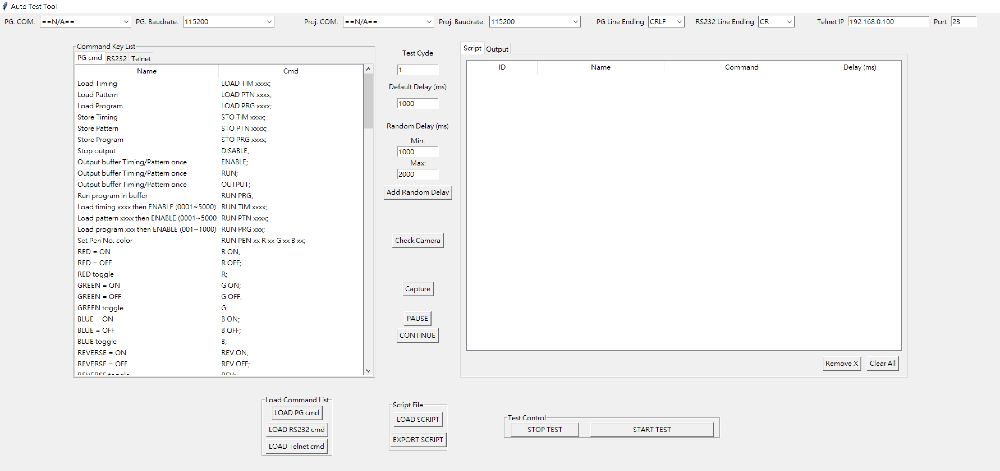

# Auto Test Tool README 
<!-- 底下標籤來源參考寫法可至：https://github.com/Envoy-VC/awesome-badges#github-stats -->

｜｜

> 這個 Auto Test Tool 是 for 控制 Pattern Gen 以及投影機，使用python編譯環境，由研發韌體一部實習生 **Jessica.Yen** 所寫。

# Auto Test Tool

## 📦專案結構
```
Test Tool/  
├── Auto Test Tool.exe                #自動化測試執行檔
├── assets/  
│   ├── command_list.yaml         #pattern gen指令集  
│   ├── dataTIM_PTN_link.yaml     #PG_tim&ptn對照  
│   └── RS232_command_list.yaml   #RS232指令集  
├── scripts/  
│   └── example_sequence.yaml     #存測試腳本 
├── logs/
│   └── log_output.txt            #存測試log output
└── captures/  
    └── capture_example.png       #截圖  
```

<font size=4>**👁‍🗨UR主介面**</font>  



> 左邊 cmd；右邊 Script；中間以及下面有一些功能按鍵

## 功能總覽
**✅支援裝置**
- Pattern Generator（預設Chroma 2235）
- 投影機控制（預設Christie）
- 外接鏡頭 (USB #1)

**✅主要功能**
- 單點擊將指令輸入腳本（支援 PG 與 RS232 指令）
- 雙點擊指令編輯
- 每筆指令可設定 Delay 時間
- 指令名稱自動對應解析度/Pattern
- 「隨機延遲」、「擷取畫面截圖」指令
- Script Load / Export（YAML 格式）
- 可設定 COM port / Baudrate
- 執行結果與回傳 Log 可即時顯示
- Pause / Continue 測試流程

## 🖥️ 使用說明  
> <font size=4><font color=#B2222>**實際操作前請先閱讀注意事項**</font>	</font>  
> **在開啟執行檔前，請確保在與執行檔同level中，有創建專案結構中的資料夾與資料集**

1. 開啟執行檔
    ```
    Auto Test Tool.exe
    ```
2. 設定連接參數
    - 選擇 PG 與 Proj. 的 COM port 與 Baudrate
    - 預設 COM ==N/A==; Baudrate 115200
3. 編輯測試腳本
    - 左側 Tab 可切換 PG  /  RS232 指令
    - cmd 點擊至右側 Script 區域
    - 可直接雙擊調整指令參數或 Delay 值
    - LOAD TIM、LOAD PTN 時，Script 自動顯示對應解析度/Pattern 名稱
4. 插入特殊指令
    - Capture：插入一筆截圖指令（來源為 CAME）
    - Add Random Delay：插入一筆隨機延遲指令，範圍自訂
5. 執行腳本
    - 點選 START TEST 開始執行
    - 指令會依序送出至相應裝置（PG / RS232 / CAMERA）
    - 結果與裝置回應顯示於 Log 區域
6. 儲存與載入腳本
    - EXPORT SCRIPT：將目前腳本匯出(YAML)
    - LOAD SCRIPT：從檔案載入腳本(YAML)
----
### 📄YAML腳本格式
```
- id: 1
  cmd: "PG: LOAD TIM 601;"
  delay: 1000
  name: "CTA-640X480P-59 4:3"
- id: 2
  cmd: "RS232: (BRT 80)"
  delay: 1000
  name: ''
- id: 3
  cmd: "CAME: CAPTURE"
  delay: 1000
  name: ''
- id: 4
  cmd: "RANDOM_DELAY:800-1500"
  delay: random
  name: "Random Delay"
```
## ❗注意事項
> <font color=#B2222>**請遵守以下操作方式，以免程式開啟多個執行序，Error~~**</font>

- 腳本中每行指令，若有更改指令參數要按下 ENTER 儲存後再做其他更動

- 開始測試腳本後 (尚未測試完成)，若中途要修改腳本指令，請先按下 ```STOP TEST``` ，再做修改，  
再次按下```START TEST``` 即可執行新的腳本
- 開始測試腳本時 (尚未測試完成)，若單純是要重新再執行一次腳本指令，請先按下 ```STOP TEST``` ，  
再按下 ```START TEST``` ，即可重新執行測試腳本，實現 RETRY
---
- 所有指令來源都需以 ```PG: / RS232: / CAME:``` 為前綴，以利系統識別發送Source
- Delay 值需 ≥ 500ms，否則會跳出警告
- 外接 USB 攝影機需插入後再執行程式，預設使用 index=1
- 若 COM port 未選擇，系統會忽略該來，並在Log [WARN]
- 腳本匯出儲存於scripts/ 資料夾中
- 截圖自動儲存於 captures/ 資料夾中
- 為確保 相機初始化時間不會過長，在相機初始化時使用了以下設定（故僅適用於 Windows 平台）：  
```cap = cv2.VideoCapture(0, cv2.CAP_DSHOW)```


## 🛠️延伸與維護
- ```assets/command_list.yaml``` 可自行匯入 Pattern Gen 指令集
- ```assets/proj_command_list.yaml``` 可自行匯入 RS232 指令集
- ```assets/dataTIM_PTN_link.yaml``` 控制 TIM/PTN 對應的 Name 顯示
- 若需加入更多裝置或指令格式，請擴充：

    - on_drag_drop 指令插入格式
    - _run_test_script 的執行邏輯
    - capture_image() 中攝影機 index 的偵測或參數化


## ⚙ 函式說明
* **class PatternGenGUI** 

  1. ```__init__()```  
  介面初始化、建Tree
  2. ```load_command_list()```\ ```load_proj_command_list()```  
  載入PG和RS232指令，匯入UR左側cmd
  3. ```on_drag_start()```\ ```on_drag_drop()```  
	拖曳指令插入腳本的邏輯
  4. ```on_double_click_script_cell()```  
  允許點擊編輯腳本內容
  5. ```stop_test()```  
  中斷連線，清除樹
  ---
  6. ```insert_random_delay_command()```  
  插入一個設定範圍的random delay指令
  7. ```insert_capture_command()```\   ```capture_image() ```  
  將截圖指令插入腳本；擷取鏡頭畫面，儲存成圖片
  8. ```remove_selected_script()```\ ```clear_script()```  
  移除目前選取的指令；	清空整個Script
  9. ```pause_test()```\ ```continue_test()```  
	測試時的控制功能
  10. ```save_log_output()```\ ```clear_log_output()```  
  儲存目前log output；清空log區域
  ---
  11. ```load_script()```  
  載入 script 到 script_tree 中
  12. ```export_script_only()```  
	匯出 script
  13. ```start_test(self)```\ ```_run_test_script(self)```  
  啟動一輪測試執行緒；依照script執行各條命令，包含判別source（PG / RS232 / CAPTURE）並處理回應
---

- **class UARTController** 

  1.```__init__()```初始化UART連接參數  
  2. ```connect()```和指定的序列埠連接  
  3. ``` send_and_wait_response()``` 傳送指令並等待裝置回應  
  4. ```disconnect()```關閉序列埠連線


